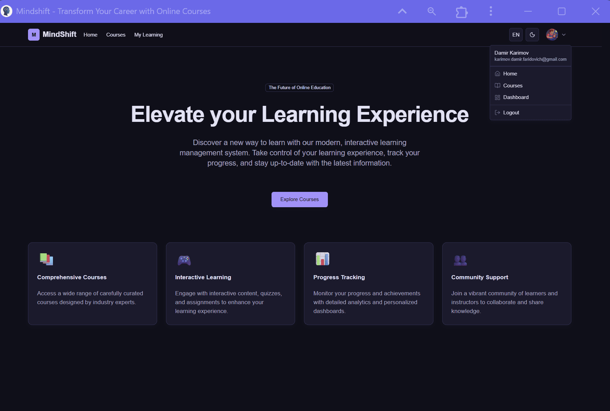
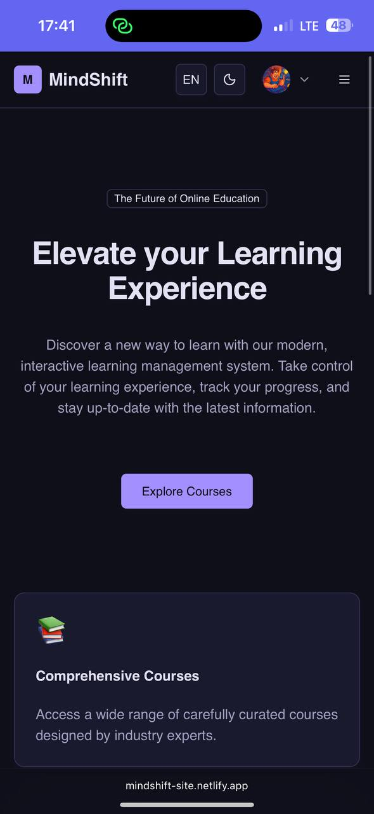

# MindShift — Home Page

The **MindShift** platform home page contains the main navigation bar (NavBar) and the user dropdown menu (User Menu). These elements define how users — both guests and authenticated users — interact with the platform.

---

## Screenshot

<table>
  <tr>
    <td align="center">
       
    </td>
    <td align="center">
       
    </td>
  </tr>
</table>

---

## Navigation Bar (NavBar)

### Guest (not authenticated):
- **Home** — returns to the landing page.  
- **Courses** — shows the **global catalog** of all courses available on the platform.  

### Authenticated User:
- **Home** — returns to the landing page.  
- **Courses** — shows the **teacher’s courses** (if the user creates/teaches courses).  
- **My Learning** — shows courses where the user is enrolled as a **student**.  

> ⚡ A single **User** can be both a student and a teacher at the same time. In that case, both *My Learning* and *Courses* will be visible.

---

## User Dropdown Menu

After authentication, the user menu appears in the top-right corner, showing account details (name and email).  

Menu items:
- **Home** — return to the landing page.  
- **Courses** — teacher’s courses (same as in NavBar).  
- **Dashboard** — teacher’s dashboard (course management, student statistics).  
- **Logout** — sign out from the account.  

---

## Access Logic Overview

- **Guest user** → `Home`, global `Courses`.  
- **Authenticated student** → `Home`, global `Courses`, plus `My Learning`.  
- **Authenticated teacher** → `Home`, teacher’s `Courses`, plus `Dashboard`.  
- **User can have both roles** (student + teacher) → sees `My Learning`, `Courses`, and `Dashboard`.  

---

## Additional Features
- **Language Switcher** — change the interface language.  
- **Theme Switcher** — toggle light/dark mode.  
