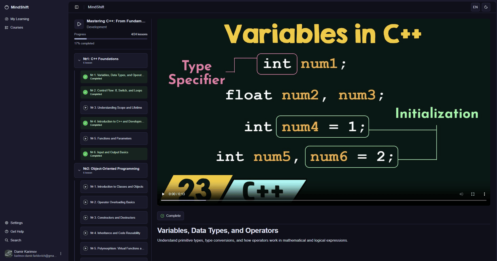
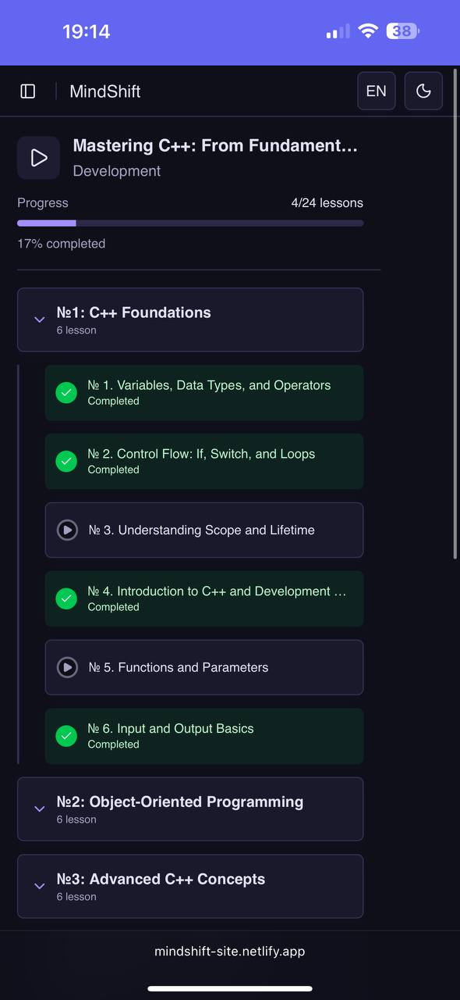
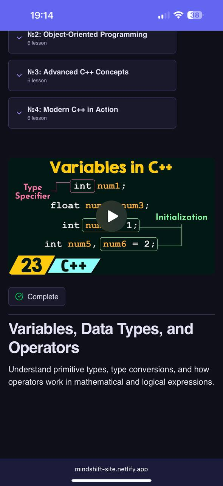

# MindShift — Student Course Page

The **Student Course Page** is where users access and progress through their enrolled course content. This is the main learning interface for watching lessons and tracking progress.

---

## Screenshot

<table>
  <tr>
    <td align="center">
       
    </td>
    <td align="center">
       
    </td>
    <td align="center">
       
    </td>
  </tr>
</table>

---

## Page Structure

### 1. Navigation Sidebar
- **MindShift logo** and branding
- **Main navigation sections**:
  - My Learning
  - Courses
- **User profile section** at bottom with avatar and email

---

### 2. Course Sidebar (Left Panel)
**Course Header**:
- **Course title**: "Mastering C++: From Fundamentals to Advanced Programming"
- **Category**: Development
- **Overall progress**: 424 lessons total, 17% completed

**Course Structure** (Collapsible sections):
- **NE1: C++ Foundations** (6 lessons)
  - Lesson status indicators (green checkmark = completed, play icon = available, lock icon = locked)
  - Individual lesson titles with completion status
- **NE2: Object-Oriented Programming** (5 lessons)
  - Expandable/collapsible lesson list
  - Sequential lesson unlocking system

**Lesson Examples**:
- ✅ NE 1: Variables, Data Types, and Operators (Completed)
- ✅ NE 2: Control Flow, If, Switch, and Loops (Completed)  
- ▶️ NE 3: Understanding Scope and Lifetime (Current/Available)
- ✅ NE 4: Introduction to C++ and Development (Completed)
- ▶️ NE 5: Functions and Parameters (Available)
- ✅ NE 6: Input and Output Basics (Completed)

---

### 3. Main Learning Area (Right Panel)
**Video Player**:
- **Full-featured video player** with standard controls
- **Progress bar** showing current position (0:00 / 6:13)
- **Video title overlay**: "Variables in C++"
- **Fullscreen and additional controls** available

**Current Lesson Content**:
- **Lesson title**: "Variables, Data Types, and Operators"
- **Lesson description**: "Understand primitive types, type conversions, and how operators work in mathematical and logical expressions"
- **Complete button**: Toggle button allowing users to mark lesson as complete/incomplete
- **Visual learning aids**: Code examples and syntax highlighting displayed in the video

---

## Learning Experience Flow

### Lesson Navigation:
1. **Sequential Learning** → Lessons unlock progressively as previous ones are completed
2. **Chapter Organization** → Content grouped into logical learning modules
3. **Progress Tracking** → Individual lesson and overall course progress saved automatically

### Video Learning Features:
- **Continuous Playback** → Auto-advance to next lesson (optional)
- **Progress Persistence** → Video position saved if user leaves and returns
- **Manual Completion** → Users can mark lessons as complete/incomplete using the Complete button

### Course Structure:
- **Modular Design** → Content divided into chapters (NE1, NE2, etc.)
- **Logical Progression** → Each chapter builds on previous knowledge
- **Flexible Navigation** → Users can revisit completed lessons anytime

---

## Access Rules

- **Enrolled Users Only** → Only accessible to users who have purchased the course
- **Sequential Unlocking** → Lessons unlock as prerequisites are completed
- **Lifetime Access** → All enrolled users retain permanent access to content
- **Progress Synchronization** → Learning progress synced across devices and sessions

---

## Additional Notes

- Course content includes video lessons with code examples and visual aids
- Progress is manually controlled by users via the Complete button
- Users can navigate between lessons using the sidebar
- Course structure supports multiple chapters with expandable lesson lists
- Video player supports standard playback controls and fullscreen mode