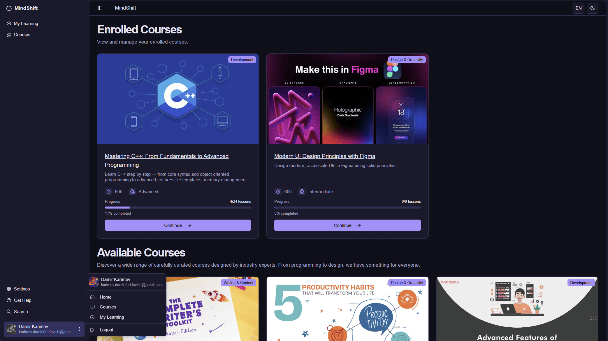
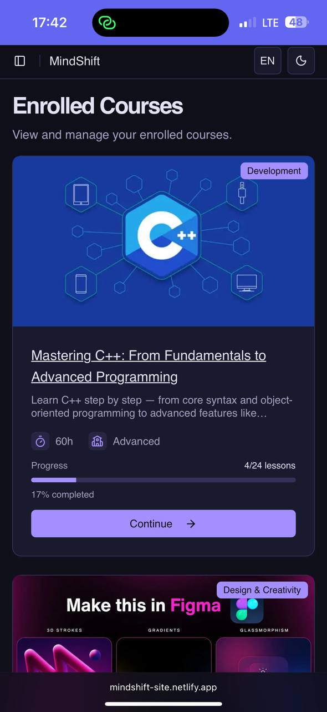

# MindShift — Student Dashboard

The **Student Dashboard** is the main learning hub where authenticated users can view and manage their enrolled courses and discover new learning opportunities.

---

## Screenshot

<table>
  <tr>
    <td align="center">
       
    </td>
    <td align="center">
       
    </td>
  </tr>
</table>

---

## Page Structure

### 1. Navigation Sidebar
- **MindShift logo** and branding
- **Main navigation sections**:
  - My Learning (current active page)
  - Courses (global catalog)
- **User profile section** at bottom with avatar and email

---

### 2. Enrolled Courses Section
**Header**: "Enrolled Courses" with subtitle "View and manage your enrolled courses"

**Course Cards** display:
- **Visual thumbnail** with course branding and category badge
- **Course title** (e.g., "Mastering C++: From Fundamentals to Advanced Programming")
- **Course metadata**:
  - Duration (e.g., 50h, 60h)
  - Difficulty level (Advanced, Intermediate)
  - Category tags (Development, Design & Creativity)
- **Progress tracking**:
  - Completion percentage (e.g., 17% completed, 0% completed)
  - Lesson progress (e.g., 424 lessons, 0/9 lessons)
- **Continue button** to resume learning

---

### 3. Available Courses Section
**Header**: "Available Courses" with subtitle about discovering curated courses from industry experts

**Course Preview Cards** showing:
- **Course thumbnails** with visual design elements
- **Category badges** (Writing & Content, Design & Creativity, Development)
- **Course titles** and brief descriptions
- **Browse/Enroll options**

---

## User Experience Flow

### Course Enrollment Process:
1. User purchases a course from the course details page
2. **After successful payment**, the course automatically appears in the **Enrolled Courses** section
3. User can then access course content via the **Continue** button

### Learning Progress:
- **Continue Learning** → Direct access to course content from enrolled courses
- **Progress Tracking** → Visual indicators show completion status and lesson progress
- **Course Management** → All purchased courses remain accessible in this section

---

## Access Rules

- **Authenticated users only** → Page is accessible only to logged-in users
- **Enrolled courses** → Shows only courses user has successfully purchased
- **Progress persistence** → Learning progress is saved and synced across sessions
- **Available courses** → Curated selection for course discovery and enrollment

---

## Additional Notes

- Dashboard displays real-time data from user's learning profile
- Course progress updates automatically when lessons are completed
- After course purchase, users are redirected back to this dashboard
- All enrolled courses provide lifetime access through this interface