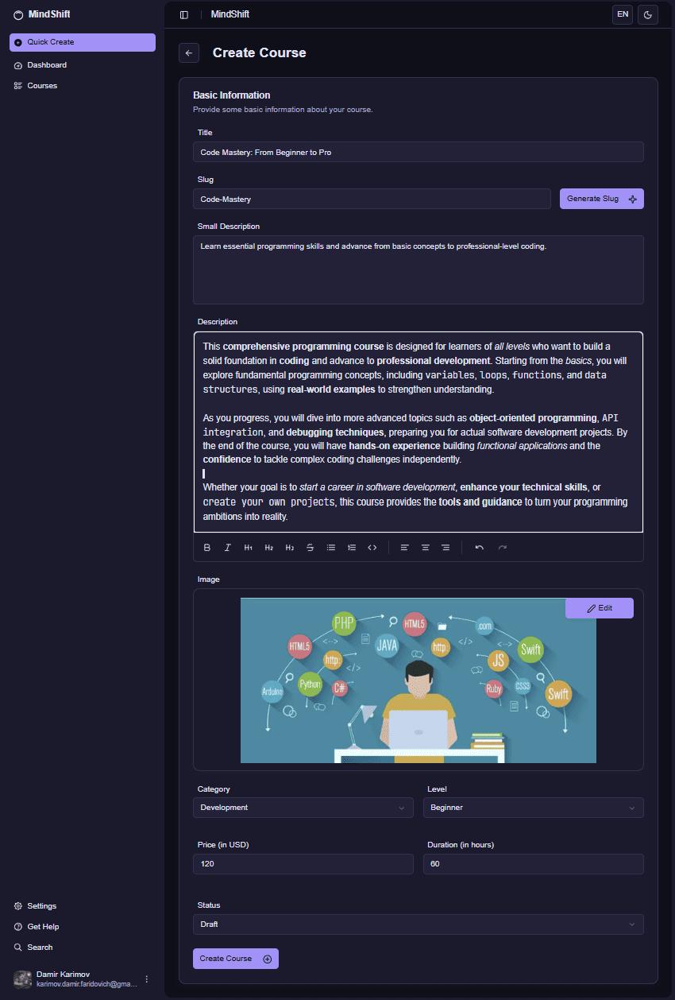

# MindShift — Teacher Course Create Page

The **Teacher Course Create Page** is where Teachers create new courses by providing basic information, content details, and course settings before publishing.

---

## Screenshot

---

## Page Structure

### 1. Navigation Sidebar
- **Quick Create button** (highlighted) showing current active function
- **Main navigation sections**:
  - Dashboard
  - Courses
- **User profile section** at bottom with avatar and email

### 2. Page Header
- **Back navigation arrow** to return to previous page
- **Page title**: "Create Course"

---

## Course Creation Form

### Basic Information Section
- **Title field**: Course name input (e.g., "Code Mastery: From Beginner to Pro")
- **Slug field**: URL-friendly course identifier with "Generate Slug" button for automatic creation
- **Small Description**: Brief course summary text area
- **Description**: Rich text editor with formatting toolbar including:
  - Text formatting (Bold, Italic, Headers)
  - Lists (Ordered, Unordered)
  - Code blocks
  - Text alignment options
  - Undo/Redo functions

### Course Media
- **Image Upload Section**: Course thumbnail/banner image
- **Edit button**: Allows modification of uploaded course image
- **Visual Preview**: Shows selected course image with programming-themed illustration

### Course Settings (Two-Column Layout)

**Left Column**:
- **Category dropdown**: Course subject selection (e.g., Development)
- **Price field**: Course cost in USD (e.g., $20)
- **Status dropdown**: Publishing status (Draft, Published, Archived)

**Right Column**:
- **Level dropdown**: Difficulty selection (Beginner, Intermediate, Advanced)
- **Duration field**: Course length in hours (e.g., 60 hours)

### Form Actions
- **Create Course button**: Saves and creates the new course

---

## Course Creation Features

### Content Management:
- **Rich Text Editor** → Full formatting capabilities for course descriptions
- **Image Upload** → Custom course thumbnails and branding
- **Metadata Configuration** → Category, level, duration, and pricing settings
- **URL Slug Generation** → Automatic SEO-friendly URL creation

### Course Settings:
- **Draft Mode** → Courses start as drafts before publishing
- **Flexible Pricing** → Custom price setting in USD
- **Category Organization** → Proper course categorization for discovery
- **Duration Planning** → Estimated course completion time

---

## Form Validation & Features

### Input Requirements:
- **Title**: Required field for course identification
- **Slug**: Auto-generated or manual URL-friendly identifier
- **Description**: Rich text content with formatting options
- **Category & Level**: Required dropdowns for course classification
- **Price & Duration**: Numeric inputs for course economics and planning

### User Experience:
- **Auto-save functionality** for draft preservation
- **Form validation** before course creation
- **Rich text formatting** for professional course descriptions
- **Image preview** for visual course representation

---

## Access Rules

- **Authenticated users only** → Page is accessible only to logged-in users
- **Draft System** → New courses start as drafts until ready for publication
- **Content Ownership** → Created courses belong to the instructor account
- **Publishing Control** → Teachers decide when courses go live

---

## Additional Notes

- Course creation follows a structured workflow from basic info to publication
- Rich text editor supports comprehensive formatting for professional descriptions
- Image upload allows for custom course branding and visual appeal
- Form includes all necessary metadata for course discovery and organization
- Draft status allows Teachers to work on courses before making them public