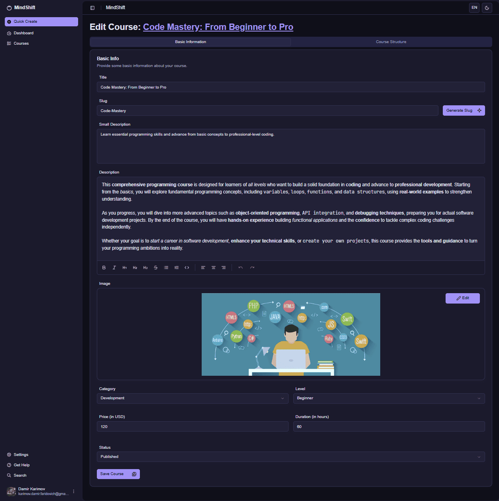
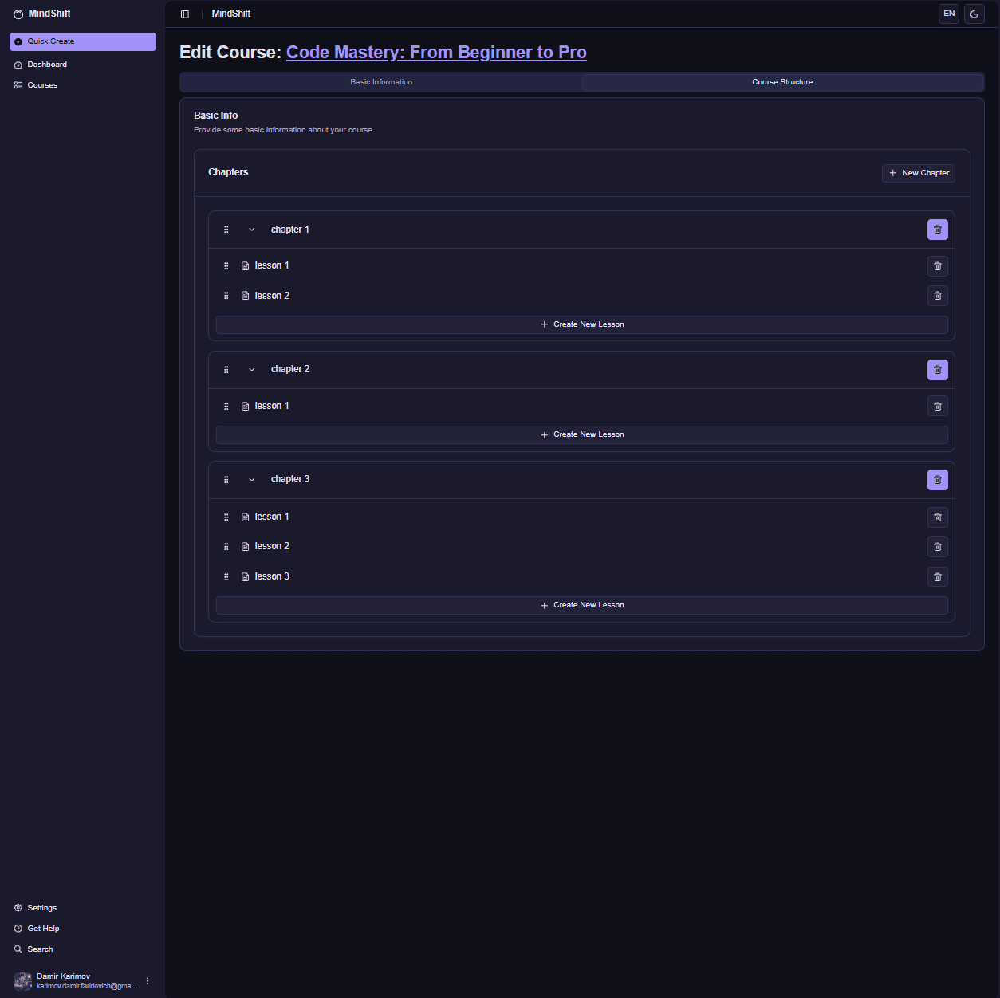
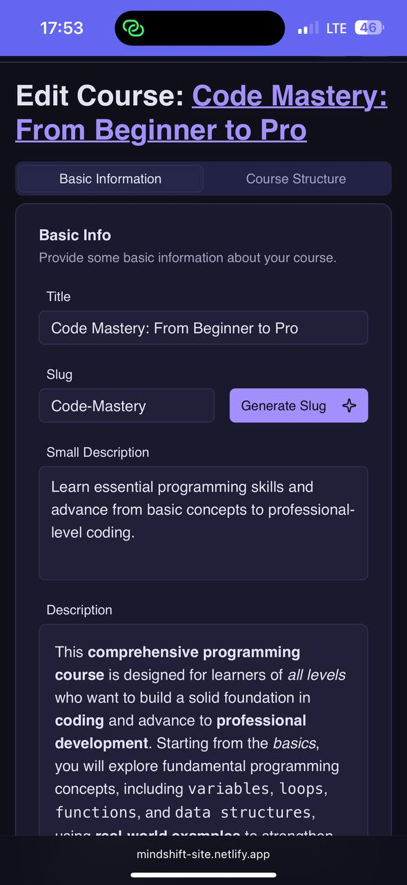
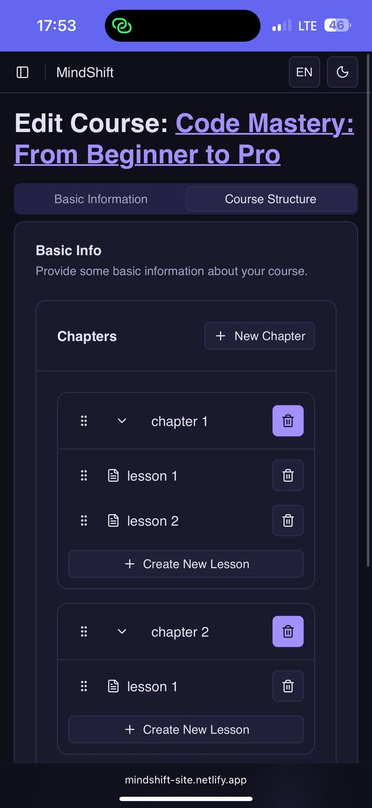

# MindShift — Teacher Course Edit Page

The **Teacher Course Edit Page** is where instructors can edit existing courses, managing both basic course information and detailed course structure with chapters and lessons.

---

## Screenshots

<table>
  <tr>
    <td align="center">
       
      <strong>📝 Basic Information Tab</strong>
    </td>
    <td align="center">
       
      <strong>🏗️ Course Structure Tab</strong>
    </td>
  </tr>
</table>

<table>
  <tr>
    <td align="center">
       
      <strong>📝 Basic Information Tab</strong>
    </td>
    <td align="center">
       
      <strong>🏗️ Course Structure Tab</strong>
    </td>
  </tr>
</table>

---

## Page Structure

### 1. Navigation Sidebar
- **Quick Create button** (highlighted) for rapid course creation
- **Main navigation sections**:
  - Dashboard
  - Courses
- **User profile section** at bottom with avatar and email

### 2. Page Header
- **Page title**: "Edit Course: Code Mastery: From Beginner to Pro"
- **Tab Navigation**: 
  - **Basic Information** (course details and settings)
  - **Course Structure** (chapters and lessons management)

---

## Basic Information Tab

### Basic Information Tab
- **Title field**: Course name input (e.g., "Code Mastery: From Beginner to Pro")
- **Slug field**: URL-friendly course identifier with "Generate Slug" button for automatic creation
- **Small Description**: Brief course summary text area
- **Description**: Rich text editor with formatting toolbar including:
  - Text formatting (Bold, Italic, Headers)
  - Lists (Ordered, Unordered)
  - Code blocks
  - Text alignment options
  - Undo/Redo functions

---

## Course Structure Tab

### Chapter & Lesson Management
**Interactive DND System**: The system implements an **interactive drag-and-drop context** that allows users to **reorder chapters and lessons**. Each list element can be **dragged using specially designated triggers** (handles), providing precise control over element positioning. This enables **flexible course structure reorganization**, easily moving lessons and chapters within or between sections. All order changes are **immediately reflected in the system**, maintaining current state for subsequent content display and management.

### Chapter Organization:
- **Chapter Cards** with collapsible/expandable structure
- **Chapter Management**:
  - Drag handles for reordering chapters
  - Delete buttons for chapter removal
  - Chapter titles with edit capability

### Lesson Management:
- **Nested lesson lists** within each chapter
- **Lesson Controls**:
  - Individual drag handles for lesson reordering
  - Delete buttons for lesson removal
  - Lesson titles and numbering
- **Add Lesson buttons** for each chapter
- **New Chapter button** to create additional chapters

---

## Course Management Features

### Content Organization:
- **Drag-and-Drop Reordering** → Intuitive course structure management
- **Chapter Management** → Create, edit, delete, and reorder chapters
- **Lesson Management** → Add, remove, and reorganize lessons within chapters
- **Hierarchical Structure** → Clear parent-child relationship between chapters and lessons

### User Experience:
- **Visual Drag Handles** → Clear indicators for draggable elements
- **Real-time Updates** → Immediate reflection of structural changes
- **Collapsible Chapters** → Clean interface for managing large course structures
- **Contextual Actions** → Chapter and lesson-specific management options

### Publishing Control:
- **Draft to Published** → Status management for course availability
- **Structure Validation** → Ensures proper course organization before publishing
- **Content Persistence** → All changes automatically saved

---

## Access Rules

- **Course Owners Only** → Only the instructor who created the course can edit
- **Published Course Editing** → Live courses can be updated without disrupting enrolled students
- **Structure Changes** → Reordering affects student navigation and progress tracking
- **Content Management** → Full editorial control over course materials and organization

---

## Additional Notes

- Tab-based interface separates basic information from structural management
- Drag-and-drop functionality provides intuitive course organization
- Changes to course structure immediately update student learning paths
- Rich text editor supports comprehensive formatting for course descriptions
- UploadThing integration ensures secure image management
- Real-time validation ensures course structure integrity