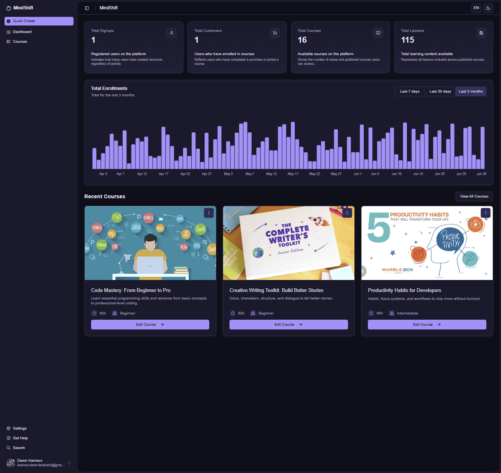

# MindShift — Teacher Dashboard Page

The **Teacher Dashboard Page** is the main analytics and overview interface for course instructors on the MindShift platform. It provides comprehensive insights into teaching performance, student engagement, course statistics, and revenue tracking for all courses created by the teacher.

---

## Screenshot

---

## Page Structure

### 1. Navigation Sidebar
- **Quick Create button** (highlighted) for rapid course creation
- **Main navigation sections**:
  - Dashboard (current active page)
  - Courses
- **User profile section** at bottom with instructor avatar and settings access

---

## Teacher Performance Metrics

### Key Teaching Statistics:
- **Total Signups**: 1 - Students who registered for teacher's courses
- **Total Customers**: 1 - Students who completed payment and enrolled
- **Total Courses**: 16 - Published courses created by this teacher
- **Total Lessons**: 115 - Individual learning content pieces across all courses

### Detailed Descriptions:
- **Registered users**: Students who showed interest in teacher's courses
- **Paying customers**: Revenue-generating enrolled students
- **Course portfolio**: Total number of published educational content
- **Content volume**: Comprehensive lesson count across teacher's curriculum

---

## Student Enrollment Analytics

### Total Enrollments Chart
- **Time Period Selector**: Last 7 days | Last 30 days | Last 3 months
- **Visual Representation**: Bar chart showing student enrollment trends
- **Data Range**: February to July with daily tracking
- **Peak Performance**: Visible enrollment spikes during promotional periods
- **Interactive Features**: Hover tooltips displaying specific enrollment numbers per day

---

## Revenue & Payment Tracking

### Financial Overview:
- **Student Payments**: Track successful course purchases
- **Revenue Analytics**: Monitor income from course sales
- **Enrollment Conversions**: Free signup to paid customer ratios
- **Course Performance**: Individual course revenue comparison

---

## Teaching Tools & Quick Actions

### Content Creation:
- **Quick Create** → Streamlined lesson and course creation
- **Bulk Upload** → Efficient content management for large courses
- **Course Templates** → Standardized course structure tools

### Student Management:
- **Enrollment Tracking** → Monitor student progress across courses
- **Engagement Analytics** → Student interaction and completion rates
- **Communication Tools** → Direct messaging and announcement features

---

## Access Rules

- **Authenticated users only** → Page is accessible only to logged-in users
- **Course Ownership** → Data limited to teacher's own courses and students
- **Real-time Updates** → Live analytics and enrollment tracking
- **Revenue Privacy** → Secure financial data access

---

## Additional Notes

- Real-time enrollment data helps teachers track student engagement trends
- Revenue metrics allow instructors to monitor course profitability and success
- Each course card offers quick access to editing and management tools
- Visual analytics charts enable data-driven decisions for course optimization
- Quick Create functionality streamlines new content development workflow

