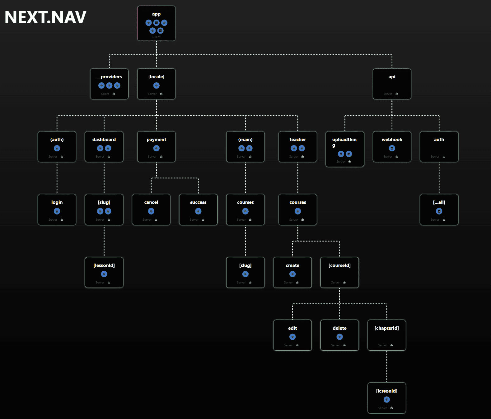

# ROUTES

This document lists all application routes with a short description of each page's purpose. Dynamic routes are noted and explained when they display data for a specific item.

## `/`
Home page — overview of the platform with featured content, calls to action and links to sign in or browse courses.

## `/login`
Login page — allows users to authenticate and access their personal dashboard or enrolled courses.

## `/courses`
Courses list page — displays available courses with options to search, filter and browse.

## `/courses/[slug]`
Course detail page (dynamic) — shows full information, syllabus and enrollment options for a specific course identified by `slug`.

## `/payment/success`
Payment success page — confirms a completed payment and shows next steps or receipt information.

## `/payment/cancel`
Payment cancel page — informs the user that the payment was cancelled and offers recovery options.

## `/dashboard`
User dashboard — overview of user progress, enrolled courses and notifications.

## `/dashboard/[slug]`
Dashboard course page (dynamic) — course-specific dashboard view for an enrolled course identified by `slug`.

## `/dashboard/[slug]/[lessonId]`
Lesson view in dashboard (dynamic) — displays a specific lesson inside an enrolled course for course `slug` and lesson `lessonId`.

## `/teacher`
Teacher dashboard — instructor overview with access to course management and statistics.

## `/teacher/courses`
Teacher courses list — lists courses created or managed by the signed-in instructor.

## `/teacher/courses/create`
Teacher create course — interface for instructors to create a new course and define its structure.

## `/teacher/courses/[courseId]`
Teacher course management (dynamic) — management view for a specific course identified by `courseId`.

## `/teacher/courses/[courseId]/[chapterId]`
Teacher chapter page (dynamic) — manage or view a specific chapter inside a course identified by `courseId` and `chapterId`.

## `/teacher/courses/[courseId]/[chapterId]/[lessonId]`
Teacher lesson page (dynamic) — manage or edit a specific lesson within a chapter for course `courseId`, chapter `chapterId` and lesson `lessonId`.

## `/teacher/courses/[courseId]/edit`
Course edit page (dynamic) — edit metadata and settings for a specific course identified by `courseId`.

## `/teacher/courses/[courseId]/delete`
Course delete confirmation (dynamic) — confirm or perform deletion of a specific course identified by `courseId`.

---

## API routes (server endpoints)

## `/api/auth/[...all]` (catch-all)
Authentication API endpoints — handles sign-in, sign-out, session/token operations and related auth requests.

## `/api/uploadthing`
File upload endpoints — receive and process file uploads, returning upload results or references.

## `/api/webhook`
Webhook receiver — endpoint for incoming events from external services (notifications, syncs, etc.).

---

## Layouts (which route groups they cover)

- Root layout — global header/footer and base shell applied across the app.
- Locale layout — wraps pages when a locale prefix is present and provides localization context.
- Public/main layout — used for public pages (e.g., `/`, `/courses`, course details).
- Auth layout — simplified layout used for authentication flows (e.g., `/login`).
- Dashboard layout — applied to `/dashboard` and its nested routes to provide consistent user navigation and tools.
- Teacher layout — applied to `/teacher` and its nested management routes for instructor workflows.
- Payment flow layout — focused layout for payment pages to reduce distractions.

Notes:
- Dynamic routes (listed above) render content for a specific resource (course, chapter, lesson or user) identified by the route parameter (e.g., `slug`, `courseId`, `chapterId`, `lessonId`).
- If your project uses a locale folder (e.g., `/[locale]/...`), routes above may be prefixed by a locale segment depending on runtime routing configuration.