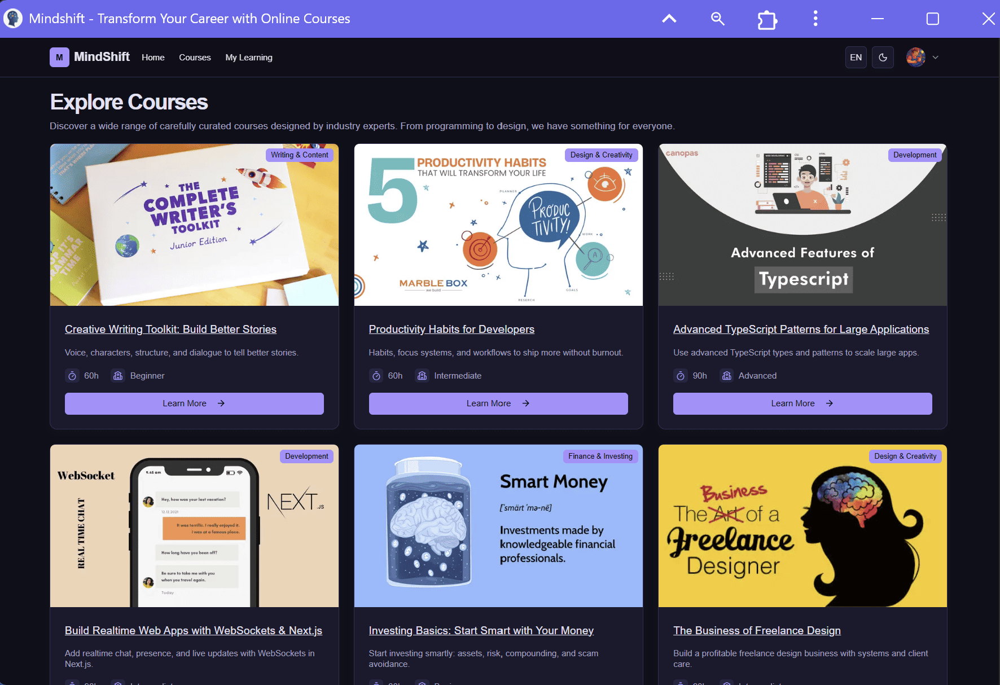

# MindShift — Courses Page

The **Courses Page** on the MindShift platform is always accessible, regardless of whether the user is authenticated or what role they have (student or teacher).  

This page serves as the **global catalog** of all courses available on the platform.

---

## Screenshot

---

## Functionality

- Displays a **catalog of all available courses**, curated across multiple categories (e.g., Development, Design, Finance, Creativity, etc.).  
- Each course card typically contains:
  - **Thumbnail image / banner**
  - **Course title**
  - **Short description**
  - **Duration and level** (e.g., Beginner, Intermediate, Advanced)
  - **Category label** (e.g., Development, Design & Creativity)
  - **Call-to-action button** (e.g., *Learn More*)  

- Clicking on a course card redirects the user to the **Course Details Page**, where they can explore full information and purchase/enroll.

---

## Access Rules

- **Guest users** → Can browse all courses but need to sign in/sign up to enroll or purchase.  
- **Authenticated users** → Same global access to all courses, with the option to directly enroll/purchase.  
