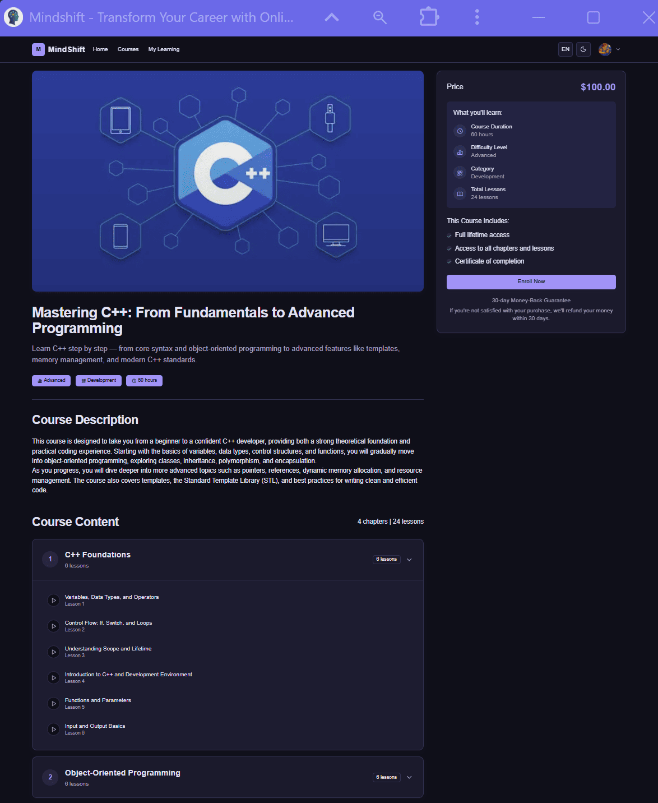
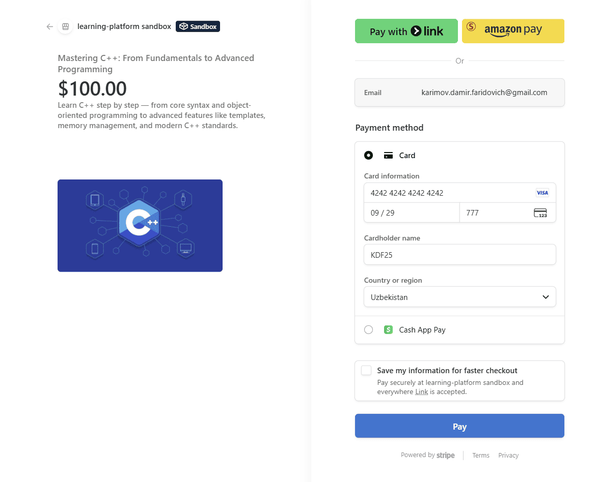

# MindShift — Course Slug Page

The **Course Details Page** is accessed by clicking on a specific course from the global course catalog.  
It provides full information about the course and allows users to purchase or enroll.

---

## Screenshot

---

## Page Structure

### 1. Course Header
- **Thumbnail / Banner image**
- **Course Title** (e.g., *Mastering C++: From Fundamentals to Advanced Programming*)
- **Short tagline** — what the course covers
- **Course metadata**:
  - Difficulty level (Beginner / Intermediate / Advanced)
  - Category (e.g., Development, Design, etc.)
  - Estimated duration (e.g., 60h)

---

### 2. Course Description
- Detailed overview of what the course teaches.  
- Key outcomes and skills gained by completing the course.  

---

### 3. Course Content
- Structured list of chapters and lessons.  
- Each chapter can expand to show lessons inside.  
- Example:  
  - *C++ Foundations* (6 lessons)  
  - *Object-Oriented Programming* (X lessons)  
  - etc.

---

### 4. Purchase / Enrollment Panel
Displayed on the right side of the page:
- **Price** of the course.  
- **What you’ll learn** section with key details:
  - Course duration  
  - Difficulty level  
  - Category  
  - Number of lessons  
- **Includes**:
  - Full lifetime access  
  - Access to all lessons and chapters  
  - Certificate of completion  
- **Call-to-action**: *Enroll Now* button  
- **Guarantee**: Money-back policy (e.g., 30-day refund guarantee).  

---

## Payment Integration (Stripe)

When a user clicks **Enroll Now**, the system redirects to a secure **Stripe Checkout** page, where payment is processed.  

- Supports major credit/debit cards and other Stripe-supported methods.  
- Ensures secure handling of payment information.  
- After successful payment, the course automatically appears in **My Learning**.  

### Stripe Checkout Screenshot

### Successful Payment Page

After completing the payment, users are redirected to a **Payment Success Page**, confirming enrollment.  

- Shows a summary of the purchased course  
- Provides a **Go to My Learning** button  
- Optional: Shows a receipt or transaction ID  

---

## Access Rules

- **Guest users** → Can view all course information but must sign in/sign up to purchase.  
- **Authenticated users** → Can purchase/enroll directly from this page.  
- After purchase, the course appears in **My Learning**.  

---

## Additional Notes
- This page uses a **slug** in the URL (e.g., `/courses/[slug]`) to dynamically load course details.  
- Content is fetched from the backend (course metadata, description, lessons).  
- The enrollment process is integrated with **Stripe** for payments.  
